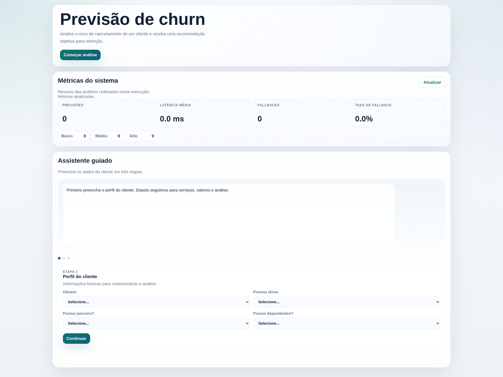
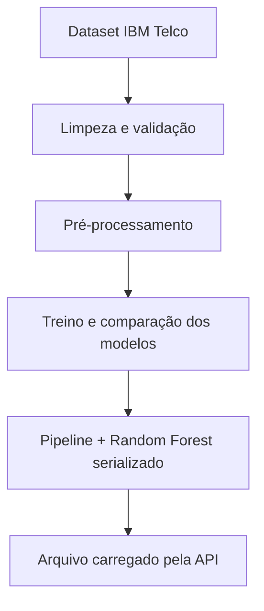
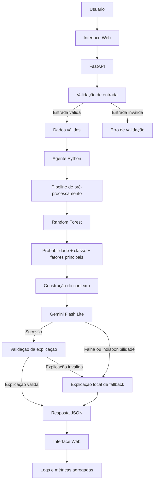
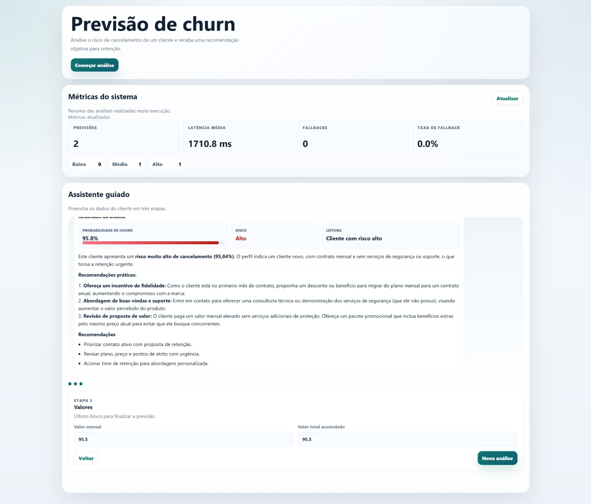
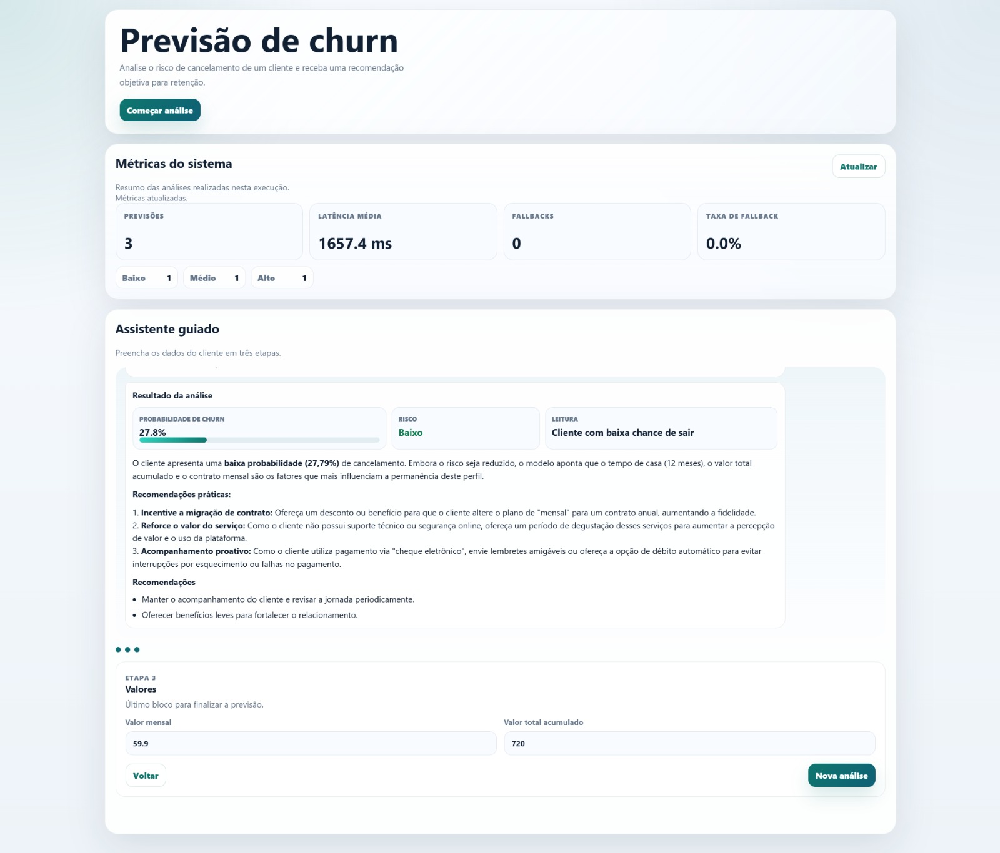

# Agente de Previsão de Churn com Explicação por IA

**Aplicação:** 
**Repositório:** [Carlos-kadu/projeto-final-tees-2026-1](https://github.com/Carlos-kadu/projeto-final-tees-2026-1)

**Equipe:**

* Patrícia Helena Macedo da Silva — 221037993
* Carlos Eduardo Rodrigues — 221031265

**Trilha:** Trilha 1 — Predição tabular <br>
**Projeto:** 1.1 — Previsão de Churn

---

## 1. Definição do problema

Empresas de telecomunicação perdem receita quando clientes cancelam seus serviços sem que o time de retenção consiga agir antecipadamente.

O objetivo deste projeto é estimar a probabilidade de churn de um cliente e apresentar o resultado de forma compreensível, combinando um modelo de aprendizado de máquina com uma explicação gerada por IA.

### Stakeholders

* **Time de retenção:** utiliza o risco previsto para priorizar contatos.
* **Gestão comercial:** acompanha os resultados das ações de retenção.
* **Cliente final:** pode receber uma abordagem mais adequada ao seu perfil.

### Métrica de negócio

Em um cenário real, o sucesso seria medido pela capacidade de identificar antecipadamente clientes que cancelariam e aumentar a taxa de retenção.

Como o projeto utiliza um dataset público e não possui dados reais de campanhas, adotamos como aproximação de negócio o `recall` da classe positiva, que indica quantos clientes que realmente cancelaram foram identificados pelo modelo.

### Métricas técnicas

As principais métricas utilizadas foram:

* `Recall`;
* `F1-score`;
* `Precision`;
* `ROC AUC`.

A acurácia também foi observada, mas não foi utilizada isoladamente devido ao desbalanceamento entre as classes.



---

## 2. Como o sistema é montado

### Arquitetura

**Treinamento offline**


**Produção**


O frontend é servido pela própria FastAPI. O agente foi implementado diretamente em Python, sem frameworks externos de orquestração.

O Random Forest calcula a probabilidade de churn. O Gemini não modifica essa previsão: ele apenas transforma o resultado em uma explicação curta em português.

### Endpoints principais

* `GET /`: interface web.
* `POST /predict`: realiza a previsão.
* `GET /health`: informa o estado da API, do modelo e do Gemini.
* `GET /metrics`: apresenta métricas agregadas.
* `GET /dataset-report`: apresenta informações sobre o dataset.
* `GET /model-card`: apresenta métricas, comparação de modelos e fairness.

### Exploração do agente e do modelo

Foram avaliadas três abordagens de classificação:

* baseline sempre `Churn=No`;
* Regressão Logística balanceada;
* Random Forest balanceado.

A Regressão Logística apresentou resultados competitivos e até superiores em algumas métricas. O Random Forest foi mantido por estar alinhado ao projeto da trilha, apresentar desempenho próximo e permitir a análise de importância dos atributos.

Para a explicação, inicialmente foram considerados textos fixos e regras determinísticas. Essas abordagens eram previsíveis, mas geravam respostas repetitivas. O Gemini foi adicionado para produzir explicações mais naturais, mantendo um fallback local para situações de falha.

### Deployment

A aplicação foi empacotada em um único container Docker.

```bash
docker compose up --build
```

Após a inicialização, a aplicação fica disponível em:

* `http://localhost:8000`;
* `http://localhost:8000/docs`;
* `http://localhost:8000/health`.

---

## 3. Descrição do agente

### Modelo base e ferramentas

O modelo preditivo utilizado foi:

* `RandomForestClassifier`;
* `class_weight="balanced"`;
* 400 árvores;
* profundidade máxima de 12;
* mínimo de 2 amostras por folha.

O modelo generativo utilizado foi o **Gemini 3.1 Flash Lite**, escolhido por apresentar capacidade suficiente para gerar explicações curtas em português, com menor custo e menor latência esperada em comparação com modelos maiores.

O modelo generativo é utilizado somente para explicar a saída do classificador.

O agente possui acesso aos seguintes componentes:

| Componente                    | Função                                                 |
| ----------------------------- | ------------------------------------------------------ |
| Validador de entrada          | Verifica campos, categorias e valores numéricos        |
| Pipeline de pré-processamento | Converte os dados para o formato esperado pelo modelo  |
| Random Forest                 | Calcula a probabilidade e a classe de churn            |
| Classificador de risco        | Converte a probabilidade em risco baixo, médio ou alto |
| Gemini                        | Gera a explicação em linguagem natural                 |
| Validador de saída            | Verifica se a resposta está coerente                   |
| Fallback determinístico       | Gera uma explicação quando o Gemini falha              |
| Logger JSONL                  | Registra eventos e erros da aplicação                  |

A previsão do Random Forest é executada localmente e não possui custo por requisição. Como o uso do Gemini permanece dentro da faixa gratuita e os prompts e respostas são curtos, a aplicação pode ser desenvolvida e demonstrada sem custo com a API generativa.

A maior parte da latência do sistema vem da chamada externa ao Gemini. A previsão do Random Forest é executada localmente e ocorre antes da geração da explicação.

### Dados e contexto

Foi utilizado o dataset **IBM Telco Customer Churn**, obtido no Kaggle:

https://www.kaggle.com/datasets/blastchar/telco-customer-churn

O dataset possui 7.043 registros, sendo:

* 5.174 clientes sem churn;
* 1.869 clientes com churn;
* 26,54% de registros na classe positiva.

Tratamentos aplicados:

* remoção de `customerID`;
* conversão de `TotalCharges` para valor numérico;
* preenchimento dos 11 valores ausentes de `TotalCharges` com `0`;
* validação das categorias;
* validação de valores negativos;
* divisão estratificada entre treino, validação e teste.

### Guardrails

#### Entrada

O sistema valida:

* campos obrigatórios;
* tipos de dados;
* valores numéricos não negativos;
* categorias conhecidas;
* ausência de campos extras.

Quando uma entrada é inválida, a previsão não é executada e a API retorna uma mensagem de validação.

#### Saída

O sistema verifica:

* resposta vazia;
* resposta excessivamente longa;
* probabilidade diferente da calculada;
* contradição com a classificação de risco;
* quantidade excessiva de recomendações;
* conteúdo fora do contexto.

Quando a resposta do Gemini é inválida ou a API está indisponível, o sistema utiliza uma explicação determinística de fallback.

### Iterações de prompt e design

Na primeira versão, o prompt solicitava apenas uma explicação do risco, o que produzia respostas genéricas e pouco controladas.

Na segunda versão, foram adicionados:

* probabilidade;
* faixa de risco;
* fatores relevantes;
* instrução para responder em português.

Na versão final, também foram incluídas regras para:

* não inventar probabilidades;
* não apresentar o cancelamento como certeza;
* limitar a resposta;
* gerar no máximo três recomendações;
* utilizar somente informações fornecidas pelo sistema.

Também foi adicionado um fallback para impedir que uma falha da API generativa interrompa a aplicação.

---

## 4. Avaliação do sistema

### Performance

O conjunto de teste possui 1.409 registros.

| Métrica   | Resultado |
| --------- | --------: |
| Accuracy  |    0.7814 |
| Precision |    0.5782 |
| Recall    |    0.6524 |
| F1        |    0.6131 |
| ROC AUC   |    0.8382 |
| Threshold |      0.54 |

Comparação entre os modelos:

| Modelo                         | Accuracy | Precision | Recall |     F1 | ROC AUC |
| ------------------------------ | -------: | --------: | -----: | -----: | ------: |
| Baseline sempre não churn      |   0.7346 |    0.0000 | 0.0000 | 0.0000 |  0.5000 |
| Regressão Logística balanceada |   0.7771 |    0.5670 | 0.6791 | 0.6180 |  0.8421 |
| Random Forest balanceado       |   0.7814 |    0.5782 | 0.6524 | 0.6131 |  0.8382 |

O baseline mostra que a acurácia isolada pode ser enganosa, pois ele alcança aproximadamente 73% sem identificar nenhum cliente que cancelou.

O threshold de `0.54` foi escolhido no conjunto de validação para maximizar o `F1-score`. O conjunto de teste foi mantido separado para a avaliação final.

### Fairness

| Grupo     | Amostras | Churn real | Recall | Precision |     F1 |
| --------- | -------: | ---------: | -----: | --------: | -----: |
| Masculino |      722 |        181 | 0.6685 |    0.5525 | 0.6050 |
| Feminino  |      687 |        193 | 0.6373 |    0.6059 | 0.6212 |

A diferença absoluta de recall foi de `0.0312`.

Essa diferença é pequena, mas deve ser monitorada. Ela não representa, isoladamente, prova de discriminação.

A análise é limitada porque o dataset não possui informações suficientes para avaliar grupos relacionados a raça, renda ou região.

### UX

A interface foi desenhada como um fluxo guiado de análise, evitando apresentar apenas uma saída técnica.

O usuário recebe:

* probabilidade de churn;
* nível de risco;
* explicação em linguagem simples;
* fatores relevantes;
* recomendações de retenção.

Quando o Gemini falha, a previsão continua disponível e o sistema apresenta uma explicação de fallback.

O resultado não é apresentado como certeza, mas como uma estimativa para apoiar uma decisão humana.





---

## 5. Demonstração

**Vídeo:** 


---

## 6. Reflexão sobre o que aprendemos

### O que funcionou bem

* separar o modelo preditivo da explicação generativa;
* treinar o modelo offline;
* manter o agente simples e auditável;
* utilizar Docker para facilitar a execução;
* implementar fallback;
* registrar logs em JSONL;
* comparar o Random Forest com outros modelos;
* documentar o threshold e as métricas.

### O que não funcionou como planejado

* depender de uma URL externa para carregar o dataset;
* utilizar prompts muito abertos, que produziam respostas genéricas.

### Limitações

* o dataset é acadêmico e relativamente pequeno;
* não existem dados reais de campanhas de retenção;
* a análise de fairness é limitada;
* a latência e o custo da API generativa ainda precisam de medição mais detalhada.

### Próximos passos

* medição mais detalhada da latência e custo;
* monitorar drift e fairness;
* avaliar o sistema com dados reais.

---

## 7. Impactos e ética

---

## 8. Referências

* Kaggle — IBM Telco Customer Churn: https://www.kaggle.com/datasets/blastchar/telco-customer-churn
* FastAPI: https://fastapi.tiangolo.com/
* Gemini API: https://ai.google.dev/