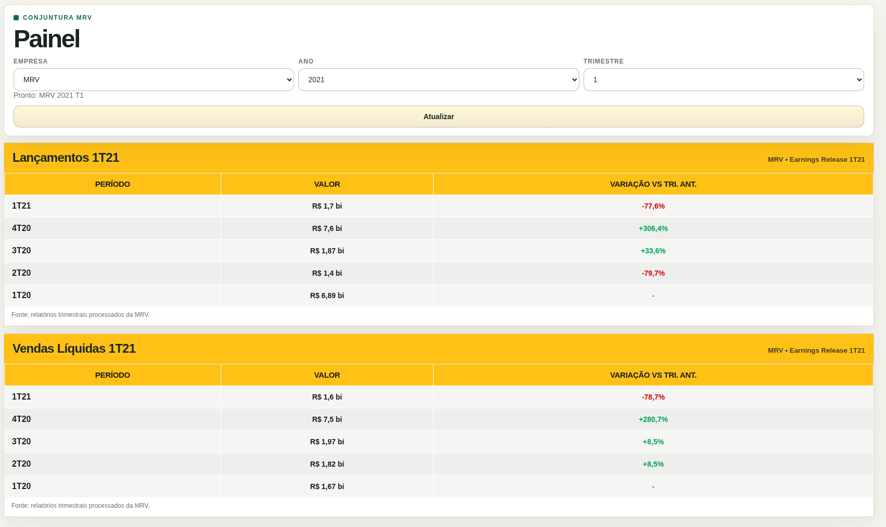

# Relatório de Entrega - Projeto 4

> **Aluno(a):** Carlos Eduardo Rodrigues e Patrícia Helena Macedo da Silva  
> **Matrícula:** 221031265; 221037993
> **Data de entrega:** 08/06/2026

---

## 1. Resumo

Este projeto implementa uma pipeline de UDA para coletar PDFs da Central de Resultados da MRV, extrair métricas financeiras e operacionais com apoio de LLM, estruturar os dados em JSON e disponibilizá-los via API.

A solução foi construída para lidar com PDFs híbridos, que alternam entre texto copiável, tabelas e páginas visualmente ricas. O fluxo atual tenta primeiro o PDF completo quando o arquivo cabe no limite configurado e, quando isso não é suficiente, usa chunks textuais, páginas visuais e heurísticas de recuperação. Também foi adicionada execução seletiva para facilitar testes e evitar processamento desnecessário.
A solução também passou a incluir um watcher local de ingestão, que atua como gatilho contínuo ao detectar novos PDFs, e um catálogo separado de linhagem para auditoria dos documentos processados.

---

## 2. O que foi entregue

- download automatizado dos releases da MRV;
- catálogo local com `sha256` e linhagem;
- watcher local para ingestão contínua de PDFs novos ou alterados;
- extração semântica com contrato estruturado;
- normalização de valores monetários, percentuais e quantidades;
- persistência em `data/processed/conjuntura_records.json`;
- API REST para consulta por empresa, ano e trimestre;
- painel HTML simples para inspeção rápida;
- catálogo de linhagem separado em JSON para auditoria;
- comparação histórica no painel até o mesmo trimestre do ano anterior;
- formatação monetária padronizada na interface, evitando misturas de `mi`, `bi` e `bilhões`;
- modo seletivo de execução para um único PDF, ano ou trimestre;
- modo de validação sem chamar a LLM quando o registro já existe.

---

## 3. Implementação principal

### 3.1 Descoberta e download

Os documentos são buscados na Central de Resultados e armazenados em `data/raw/mrv/releases/<ano>/`.

O catálogo em `data/catalog/mrv_release_catalog.json` registra:

- empresa;
- título;
- ano;
- trimestre;
- URL;
- caminho local;
- hash;
- status.

### 3.2 Extração

A extração combina:

- parsing textual do PDF;
- envio do PDF completo ao Gemini quando possível;
- páginas visuais enviadas ao Gemini;
- lotes menores para reduzir custo;
- recuperação agressiva apenas para métricas faltantes;
- validação final por contrato semântico.

### 3.3 Persistência

Os dados estruturados são salvos com:

- identificadores do documento;
- métricas encontradas;
- observações;
- origem e linhagem.

Também é gravado um catálogo de linhagem em `data/catalog/mrv_lineage_catalog.json`, com a origem, o gatilho de ingestão e os caminhos envolvidos em cada extração.

---

## 4. Como executar

### 4.1 Configurar o ambiente

```bash
python3 -m venv .venv
source .venv/bin/activate
pip install -r requirements.txt
cp .env.example .env
```

Edite o `.env` e informe a chave:

```bash
GEMINI_API_KEY=...
GEMINI_MODEL=gemma-4-26b-a4b-it
```

### 4.2 Baixar os PDFs

```bash
python3 scripts/download_mrv_reports.py --start-year 2020 --end-year 2026
```

### 4.3 Extrair e estruturar

```bash
python3 -u scripts/extract_mrv_reports.py
```

### 4.4 Rodar a API

```bash
python3 scripts/serve_conjuntura_api.py
```

### 4.5 Consultar a API

```bash
curl "http://127.0.0.1:8000/api/conjuntura?empresa=MRV&ano=2026&trimestre=1"
curl "http://127.0.0.1:8000/api/dashboard/conjuntura?empresa=MRV&ano=2025&trimestre=3"
```

### 4.6 Validação da base

```bash
python3 scripts/qa_mrv_records.py
```

---

## 5. Execução seletiva

Os modos abaixo ajudam a testar apenas o documento necessário:

```bash
# Um ano e trimestre
python3 -u scripts/extract_mrv_reports.py --year 2026 --quarter 1 --force

# Um PDF específico
python3 -u scripts/extract_mrv_reports.py --file data/raw/mrv/releases/2026/2026_Q1_earnings-release-1t26.pdf --force

# Um documento por ano
python3 -u scripts/extract_mrv_reports.py --one-per-year --recent-only

# Apenas validar registros já persistidos
python3 -u scripts/extract_mrv_reports.py --validate-only
```

---

## 6. Evidências de funcionamento

Durante a implementação, foram validados:

- a seleção seletiva antes do processamento custoso;
- a persistência em `conjuntura_records.json`;
- a consulta real à API;
- o painel HTML;
- a validação da base com o script de QA;
- a correção de métricas que apareciam apenas em gráficos ou blocos visuais;
- a remoção de colunas e cards laterais que poluíam a leitura do painel;
- a normalização das comparações trimestre a trimestre.

### Painel visual



### Evidência de API

```bash
curl -sS "http://127.0.0.1:8000/api/conjuntura?empresa=MRV&ano=2021&trimestre=1"
```

```json
{
  "success": true,
  "count": 1,
  "data": [
    {
      "schema_version": "1.0",
      "empresa": "MRV",
      "ano": 2021,
      "trimestre": 1,
      "titulo_documento": "Earnings Release 1T21",
      "source_url": "https://api.mziq.com/mzfilemanager/v2/d/4b56353d-d5d9-435f-bf63-dcbf0a6c25d5/eaa9bbd3-b8aa-822a-d9ad-227f438ea0a2?origin=2",
      "sha256": "e636c73fbd73aecce8d0ed615668f70c8a456d7be4de42fe664597e357ef98d4",
      "metricas": {
        "receita_operacional_liquida": {
          "valor_textual": "1.598",
          "valor_numerico": 1598,
          "unidade": "R$ milhões",
          "pagina": 6,
          "trecho_evidencia": "Receita Operacional Líquida 1.598 1.702 1.508",
          "encontrado": true
        },
        "lucro_liquido": {
          "valor_textual": "137",
          "valor_numerico": 137,
          "unidade": "R$ milhões",
          "pagina": 6,
          "trecho_evidencia": "Lucro Líquido 137 196 104",
          "encontrado": true
        },
        "ebitda": {
          "valor_textual": "211",
          "valor_numerico": 211,
          "unidade": "R$ milhões",
          "pagina": 6,
          "trecho_evidencia": "EBITDA 211 327 203",
          "encontrado": true
        },
        "margem_bruta": {
          "valor_textual": "27,8%",
          "valor_numerico": 27.8,
          "unidade": "%",
          "pagina": 6,
          "trecho_evidencia": "Margem Bruta (%) 27,8% 28,4% 28,1%",
          "encontrado": true
        },
        "vendas_liquidas": {
          "nome": "vendas_liquidas",
          "valor_textual": "R$ 1,6 bilhão",
          "valor_numerico": 1.6,
          "unidade": "bilhões",
          "pagina": 2,
          "trecho": "Vendas Líquidas de R$ 1,6 bilhão",
          "encontrado": true,
          "trecho_evidencia": "Vendas Líquidas de R$ 1,6 bilhão"
        },
        "lancamentos": {
          "nome": "lancamentos",
          "valor_textual": "R$ 1,7 bilhão",
          "valor_numerico": 1.7,
          "unidade": "bilhões",
          "pagina": 2,
          "trecho": "Maior volume de Lançamentos em um primeiro trimestre da história da Companhia, totalizando R$ 1,7 bilhão",
          "encontrado": true,
          "trecho_evidencia": "Maior volume de Lançamentos em um primeiro trimestre da história da Companhia, totalizando R$ 1,7 bilhão"
        },
        "unidades_produzidas": {
          "valor_textual": "9.191",
          "valor_numerico": 9191,
          "unidade": "unidades",
          "pagina": 13,
          "trecho_evidencia": "Unidades Produzidas 9.191 9.849 8.070",
          "encontrado": true
        },
        "repasses": {
          "valor_textual": "10.552",
          "valor_numerico": 10552,
          "unidade": "unidades",
          "pagina": 13,
          "trecho_evidencia": "Unidades Repassadas 10.552 11.659 6.752",
          "encontrado": true
        },
        "estoque": {
          "valor_textual": "7,84",
          "valor_numerico": 7.84,
          "unidade": "R$ bilhões",
          "pagina": 14,
          "trecho_evidencia": "Estoque a valor de mercado (R$ bilhões)* 7,84 7,56 8,26",
          "encontrado": true
        },
        "vso": {
          "valor_textual": "17,4%",
          "valor_numerico": 17.4,
          "unidade": "%",
          "pagina": 8,
          "trecho_evidencia": "VSO - Vendas Líquidas 17,4% 18,6% 16,5%",
          "encontrado": true
        },
        "distratos": {
          "valor_textual": "164",
          "valor_numerico": 164,
          "unidade": "R$ milhões",
          "pagina": 10,
          "trecho_evidencia": "Distratos (VGV) 164",
          "encontrado": true
        },
        "geracao_caixa": {
          "valor_textual": "(384,1)",
          "valor_numerico": -384.1,
          "unidade": "R$ milhões",
          "pagina": 11,
          "trecho_evidencia": "Geração de Caixa (em R$ milhões) (384,1) 174,2 (328,3)",
          "encontrado": true
        }
      },
      "observacoes": [
        "Valores de geração de caixa e distratos foram extraídos das tabelas consolidadas do grupo MRV&Co.",
        "heuristicas_aplicadas_em_metricas_ausentes=2"
      ],
      "stored_path": "data/raw/mrv/releases/2021/2021_Q1_earnings-release-1t21.pdf",
      "modo_extracao": "llm_json_schema_primary+heuristic_recovery"
    }
  ]
}
```

---

## 7. Limitações conhecidas

- alguns releases recentes ainda têm páginas que precisam de recuperação mais agressiva;
- algumas métricas podem não aparecer em todos os documentos;
- o layout dos PDFs muda ao longo dos anos, então alguns casos exigem múltiplos passes.

---

## 8. Considerações finais

O projeto cumpre o objetivo de estruturar os PDFs da MRV em uma base consultável e rastreável.

O principal ganho foi abandonar dependência de layout fixo e passar a tratar o PDF como documento semiestruturado, combinando parsing, visão, validação e persistência.
